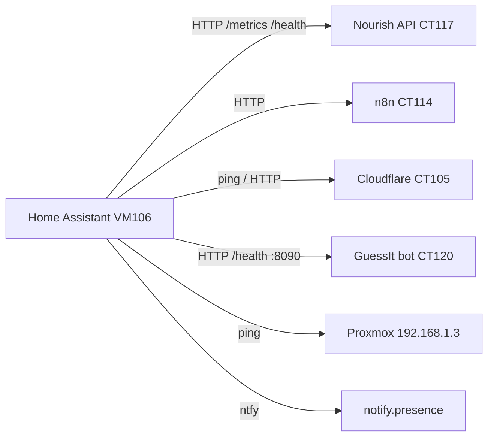

# Homelab monitoring (HA + Proxmox)

Sensors and automations for service health, Nourish shop-interval sync, and Proxmox CT reachability. Deployed as HA packages from this repo.

## Architecture



## HA packages (`homelab/ha-packages/`)

| Package | Purpose |
|---------|---------|
| `homelab_health.yaml` | Binary sensors: n8n, nourish API, Grocy, cloudflare CT, guessit-bot, Proxmox host |
| `homelab_alerts.yaml` | ntfy alert when any service offline 3+ min; recovery ping |
| `homelab_nourish_metrics.yaml` | REST sensors (shop interval, fuel prices); auto-sync `input_number.nourish_days_until_shop` |
| `homelab_proxmox.yaml` | Ping sensors for CT105/114/117/120 |
| `nourish_wifi_presence.yaml` | Home Wi‑Fi binary sensor (`francisco_em_wifi_de_casa`) |
| `nourish_high_accuracy_gps.yaml` | Force high-accuracy GPS when away; turn off on home Wi‑Fi / person home |
| `nourish_smart_shopping.yaml` | Supermarket zone automations + rest_commands |
| `nourish_supermarket_discovery.yaml` | Unknown supermarket detection |

## Deploy

```bash
# 1. Refresh nourish API on CT117 (adds GET /health)
./homelab/install-smart-shopping.sh

# 2. Deploy HA packages + patch presence automations
HA_TOKEN=… ./homelab/deploy-ha-smart-shopping.sh

# 3. GuessIt bot health endpoint (CT120)
#    Redeploy bot code, then on CT120:
#    systemctl restart guessit-bot
#    curl http://192.168.1.116:8090/health

# 4. Optional n8n backup sync (daily 06:00)
#    Import homelab/n8n/nourish-sync-shop-interval-import.json
#    Replace HA_TOKEN_PLACEHOLDER, activate workflow
```

HA also syncs `input_number.nourish_days_until_shop` natively via `homelab_nourish_metrics.yaml` (every 30 min + 06:00 + 2 min after leaving supermarket). The n8n workflow is optional redundancy.

## Key entities

| Entity | Meaning |
|--------|---------|
| `binary_sensor.homelab_critical_services_ok` | All core services online |
| `sensor.nourish_suggested_days_until_shop` | Median days between supermarket visits |
| `sensor.fuel_diesel_median_pt` | National median diesel (DGEG via CT117) |
| `binary_sensor.francisco_em_wifi_de_casa` | Phone on home Wi‑Fi |
| `input_number.nourish_days_until_shop` | Used by leave-home despensa check |

## Presence automations (patched in `automations.yaml`)

**Leave home** (`francisco_sai_de_casa`) triggers on any of:

- Wi‑Fi disconnect from home SSIDs (~45 s debounce) — primary, fast path
- Zone leave `zone.home` — GPS backup
- Person state leaves `home` — GPS backup

A 10‑minute cooldown prevents the slow GPS backup from re-firing after Wi‑Fi already triggered.

Actions: ntfy presence → `POST /event leave_home` → n8n despensa check.

**Arrive home** (`francisco_chega_a_casa`) triggers on any of:

- Person state `home`
- Zone enter `zone.home`
- Wi‑Fi reconnect to home SSIDs

Action: ntfy presence only (no shopping alert).

## Optional: full Proxmox VE integration

Ping sensors cover CT reachability. For CPU/RAM/disk and backup job status, add the official **Proxmox VE** integration in HA:

1. Proxmox → Datacenter → Permissions → API Tokens → create token for `ha@pve`
2. HA → Settings → Devices & services → Add integration → Proxmox VE
3. Host `192.168.1.3`, node `pve`, token auth, disable SSL verify (self-signed)

Then create automations on `binary_sensor.*_status` or backup sensors Proxmox exposes.

## Test

```bash
# Service health
curl -s http://192.168.1.27:8787/health
curl -s http://192.168.1.116:8090/health

# Metrics / shop interval
curl -s http://192.168.1.27:8787/metrics | jq .

# Manual n8n sync (after import)
curl -X POST http://192.168.1.24:5678/webhook/nourish-sync-shop-interval
```

In HA: **Developer Tools → States** → search `homelab_` or `nourish_suggested`.
