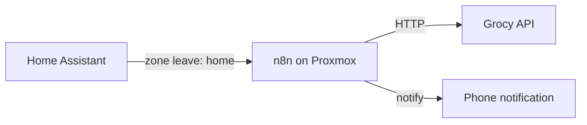

# Smart shopping when leaving home

Nourish stores despensa consumption in **Grocy**. The app already flags products when **days of stock remaining** is less than **typical days between your supermarket trips** (see `src/utils/despensaAnalytics.ts`).

This guide wires that logic to **Home Assistant** (are you away / leaving home) and **n8n** (run the check, update Grocy, notify you).

## Does it make sense?

Yes. The flow is:

1. **Learn how often you shop** — from Grocy purchase history per product, or from HA (how often you enter a “Supermarket” zone).
2. **Estimate days until the next trip** — e.g. median days between shops, or “next expected shop in X days” from your calendar/HA.
3. **For each despensa product**, if `daysRemaining < daysUntilNextShop` → add to Grocy shopping list (same as the ⚠ button in the app).
4. **When you leave home** → HA triggers n8n → script runs → **mobile notification** with the list.

Nourish PWA does not need to be open; Grocy is the source of truth.

## Architecture



## 1. Home Assistant — presence & supermarket frequency

### Leaving home

Use a **zone** `zone.home` and a person device tracker:

```yaml
# automation example (packages or automations.yaml)
automation:
  - alias: "Nourish — saída de casa"
    trigger:
      - platform: zone
        entity_id: person.YOUR_PERSON
        zone: zone.home
        event: leave
    action:
      - service: rest_command.nourish_despensa_check
        # or webhook to n8n — see below
```

### Supermarket visit frequency (optional but better)

Create a **Supermarket** zone around your usual store(s). Count visits:

```yaml
template:
  - sensor:
      - name: "Supermarket visits (30d)"
        state: >
          {{ states('counter.supermarket_visits_30d') | int(0) }}

counter:
  supermarket_visits_30d:
    ...
```

On zone enter `zone.supermarket`, increment counter and maintain a **`input_number.nourish_days_until_shop`** (manually tuned) or **`input_number.nourish_shop_interval_days`** updated by a statistics / utility meter automation.

Simplest start: set a fixed helper:

```yaml
input_number:
  nourish_days_until_shop:
    name: Days until next supermarket trip
    min: 1
    max: 21
    step: 0.5
    unit_of_measurement: days
    icon: mdi:cart
```

You adjust this when you know you’ll shop in 2 days, or let an automation set it from median visit interval.

## 2. n8n workflow (recommended)

1. **Webhook** node (POST from HA `rest_command` or HA → n8n Webhook trigger).
2. **HTTP Request** — optional: read `input_number.nourish_days_until_shop` from HA REST API.
3. **Execute Command** on Proxmox host (or SSH node):

```bash
cd /path/to/nourish && \
  GROCY_HOST=192.168.1.61:9192 \
  GROCY_API_KEY=your-key \
  DAYS_UNTIL_SHOP=3 \
  node scripts/grocy-despensa-check.mjs
```

4. **IF** JSON `added.length > 0`
5. **Home Assistant** `notify.send_message` with top-level `entity_id: notify.telemovel_francisco` (not nested under `data`).

### HA `rest_command` calling n8n

```yaml
rest_command:
  nourish_despensa_check:
    url: "http://N8N_HOST:5678/webhook/nourish-leave-home"
    method: POST
    content_type: "application/json"
    payload: '{"days_until_shop": {{ states("input_number.nourish_days_until_shop") | float }}}'
```

## 3. Check script (in this repo)

`scripts/grocy-despensa-check.mjs` mirrors the app logic:

- Loads despensa stock + stock log from Grocy
- Uses `DAYS_UNTIL_SHOP` (env or argv) as “time until next supermarket run”
- Adds missing items to the shopping list
- Prints JSON: `{ added: [...], intervalHint: number | null }`

Run manually:

```bash
GROCY_HOST=192.168.1.61:9192 GROCY_API_KEY=xxx DAYS_UNTIL_SHOP=4 node scripts/grocy-despensa-check.mjs
```

## 4. Notifications (two channels)

| Channel | Used for |
|---------|----------|
| **ntfy** topic `presence` via HA `notify.presence` | Arrive / leave home (automations use `notify.send_message`, not `notify.ntfy_presence`) — only devices subscribed to that topic |
| **HA Companion** `notify.telemovel_francisco` | Nourish shopping list alerts from n8n — **Francisco’s phone only** (`notify.anasta` is never used) |

**Avoid duplicate pings:** leave home can send **two** channels (presence ntfy + Companion if the despensa check adds items). Supermarket arrival notifies **only when the Grocy list has pending items** (n8n `List has items?` gate).

**Not in the PWA yet:** Web Push when leaving home would need a backend + geofence; HA + n8n is the right place for that.

## 5. Tuning & limits

| Topic | Note |
|--------|------|
| New products | Need **≥2 consume** log lines before rate estimate works (same as Despensa UI). |
| Global shop interval | Script can use **median** purchase interval across products if `DAYS_UNTIL_SHOP` unset. |
| HA “away” vs “leave home” | Use **leave** if you only want alerts when exiting; use **not_home** if you also want checks while travelling. |
| Security | Keep `GROCY_API_KEY` on the server (n8n/HA secrets), not in the phone app. |

## Quick setup (this repo)

### Live stack (2026-06-02)

| Piece | Status |
|--------|--------|
| **CT117** `POST http://192.168.1.27:8787/check` | `nourish-check.service` |
| **n8n** workflow `Nourish — despensa ao sair de casa` (`yfLrWmTcwKUDqerk`) | Active; webhook `http://192.168.1.24:5678/webhook/nourish-leave-home` |
| **HA** `rest_command.nourish_despensa_check` + `input_number.nourish_days_until_shop` | In `configuration.yaml` |
| **HA** automation `francisco_sai_de_casa` | `notify.send_message` → `notify.presence` (ntfy topic) + `rest_command.nourish_despensa_check` |
| **Shopping alert** | n8n → `notify.telemovel_francisco` (Companion) only when items are added — separate from ntfy presence |

Install / refresh:

```bash
./homelab/install-smart-shopping.sh          # CT117 check API + script
HA_TOKEN=... ./homelab/deploy-ha-smart-shopping.sh   # HA VM 106 (restarts HA)
```

Set n8n **Notify HA phone** body to:

```json
{ "message": "…", "title": "Compras — saíste de casa", "entity_id": "notify.telemovel_francisco" }
```

Store the HA token in n8n credentials or env — never commit tokens to git.

### n8n (CT114 — 192.168.1.24)

Import `homelab/n8n/nourish-leave-home-import.json` (replace `HA_TOKEN_PLACEHOLDER` locally before import). Workflow uses HTTP to CT117 and HA — no SSH node required.

### Home Assistant

Helper **Dias ate ao supermercado** (`input_number.nourish_days_until_shop`, default 4). Tweak in **Settings → Helpers** before your next shop trip.

Test webhook manually:

```bash
curl -X POST http://192.168.1.24:5678/webhook/nourish-leave-home \
  -H 'Content-Type: application/json' \
  -d '{"days_until_shop": 4}'
```

## 6. Next steps you can add later

- HA automation: after each **supermarket zone enter**, call Grocy to log a purchase (advanced).
- n8n weekly job: recompute `input_number.nourish_shop_interval_days` from zone history.
- Expose a tiny HTTP service on the Nourish LXC that wraps the script (if you prefer not to use Execute Command).
