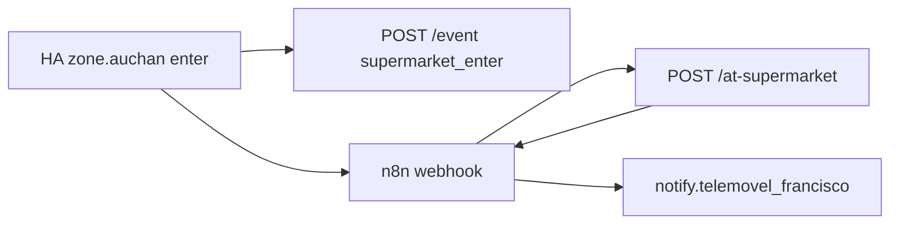

# Supermarket arrival + visit metrics

## Flow



Leave home also `POST /event` with `leave_home` (for Perfil metrics).

## Endpoints (CT117 :8787, proxied as `/nourish/` on nginx)

| Method | Path | Purpose |
|--------|------|---------|
| GET | `/metrics` | Visits per week/month, median days between shops |
| GET | `/supermarket-visits?days=90` | Visit history (enter/leave times, duration) |
| GET | `/trip-distance?zone=zone.auchan` | Round-trip km home ↔ supermarket (OSRM, or zone-coordinate fallback) |
| POST | `/sync-zone-coords` | Pull zone lat/lon from HA (needs `HA_URL` + `HA_TOKEN` on server) |
| POST | `/event` | `supermarket_enter` (optional `zone`), `supermarket_leave`, or `leave_home` |
| POST | `/at-supermarket` | JSON shopping list summary |
| POST | `/check` | Despensa check (existing) |

## Deploy

```bash
./homelab/install-smart-shopping.sh
# redeploy nginx with /nourish/ proxy (from repo nginx.conf)
```

Import n8n workflow `homelab/n8n/nourish-at-supermarket-import.json`.

Supermarket automations live in `homelab/ha-packages/nourish_smart_shopping.yaml` — reload HA packages after deploy.

## Supermarket discovery (3 min dwell)

Package `homelab/ha-packages/nourish_supermarket_discovery.yaml`:

1. Detects supermarket-like geocoded places not yet tracked on the Nourish server
2. Waits **3 minutes** at the same place
3. Phone notification: **Acompanhar** (track) or **Ignorar** (blocklist)
4. Tracked supers get coordinates in `zone-coords.json` for trip routing
5. **Acompanhar** creates a **~130 m HA zone** at your current GPS. With `HA_URL` + `HA_TOKEN` on the nourish server, enter/leave automations are added automatically.

### How detection works (no Nourish API)

All detection runs in **Home Assistant**:

1. **Companion app** sends phone GPS to HA
2. **`sensor.*_geocoded_location`** reverse-geocodes coordinates to a place name (uses HA’s geocoder — typically via your existing HA/mobile setup, not a separate Nourish service)
3. Nourish matches **keywords** in that name (Continente, Lidl, Auchan, …)
4. After **3 minutes** at the same unknown place → notification

Optional on CT117 `/etc/nourish/env` for auto enter/leave automations:

```
HA_URL=http://192.168.1.61:8123
HA_TOKEN=your_long_lived_token
```

Manage lists in the app: **Perfil → Casa**.

| Method | Path | Purpose |
|--------|------|---------|
| GET | `/supermarkets` | Tracked + blocklist |
| POST | `/supermarket-prompt` | HA checks if notification should fire |
| POST | `/supermarkets/respond` | `action: track` or `block` |

Deploy HA package: `HA_TOKEN=… ./homelab/deploy-ha-smart-shopping.sh` (includes discovery YAML).

## Trip distance (OSRM)

1. Copy `homelab/zone-coords.example.json` → `/opt/nourish/data/zone-coords.json` on CT117 (or run install script).
2. Set real coordinates — easiest:  
   `HA_URL=http://192.168.1.61:8123 HA_TOKEN=… node homelab/sync-zone-coords-from-ha.mjs`  
   (on CT117, or `POST /nourish/sync-zone-coords` if `HA_URL`/`HA_TOKEN` are in the service env).
3. Enter events should include the zone id, e.g. `{"type":"supermarket_enter","zone":"zone.auchan"}`.
4. Visits in Historial get `trip_distance_km` (OSRM road routing, falling back to straight-line distance between zone centres); fuel cost uses that automatically.

Optional: `OSRM_BASE_URL` on the server (default: public `router.project-osrm.org`).
