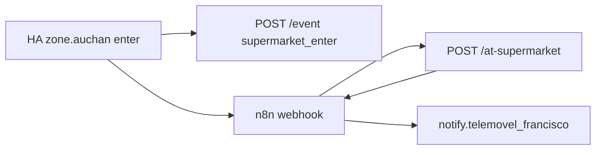

# Supermarket arrival + visit metrics

## Flow



Leave home also `POST /event` with `leave_home` (for Perfil metrics).

## Endpoints (CT117 :8787, proxied as `/nourish/` on nginx)

| Method | Path | Purpose |
|--------|------|---------|
| GET | `/metrics` | Visits per week/month, median days between shops |
| POST | `/event` | `{"type":"supermarket_enter"}` or `leave_home` |
| POST | `/at-supermarket` | JSON shopping list summary |
| POST | `/check` | Despensa check (existing) |

## Deploy

```bash
./homelab/install-smart-shopping.sh
# redeploy nginx with /nourish/ proxy (from repo nginx.conf)
```

Import n8n workflow `homelab/n8n/nourish-at-supermarket-import.json`.

Add HA package `homelab/ha-packages/nourish_supermarket_metrics.yaml` (underscore slug) and reload.
